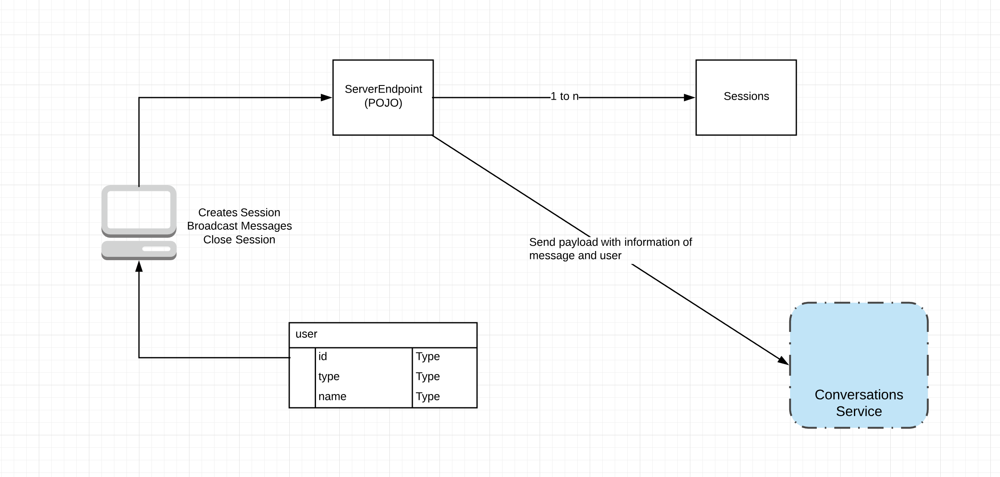

# Conversations Java Web Application Sockets

## Set-up

### Tomcat (version 9.0.14)

Please Follow this [link](https://www.mulesoft.com/tcat/tomcat-linux) to setup
your local tomcat server.

Current set-up uses Java 11.

### IntelliJ Ultimate

Go to Preferences -> Build, Execution, Deployment -> Application Servers
and click on `+` and add tomcat server.

Go to Run -> Edit Configuration... and click on `+` and click on Tomcat Server
-> Local to connect local tomcat server to the created war file

Run the tomcat server.

You should see: 

### POC 

#### Findings
1. A session is a 1-to-1 conversation between the server and client 
(i.e. agent to a customer). We can control how a session get started 
(ideally when a customer sends the first message). We can also control 
when a session is closed, but a session is automatically closed when a 
customer closes/refreshes the page.

2. This library uses binary messages in order to represent any images, 
audio, etc.

3. With these sessions, this library associates each session is aware of
 other sessions based on the Websocket endpoint. We’ll have to manage 
 the relationship between the user, session, and conversations ourselves.
 
 Go to [Stackoverflow answer](https://stackoverflow.com/questions/32426674/notify-only-specific-users-through-websockets-when-something-is-modified-in-t)
 for more detailed information about essential classes and methods. In 
 addition, there's an example of how to send messages to specific
 users.
 

#### Architecture

