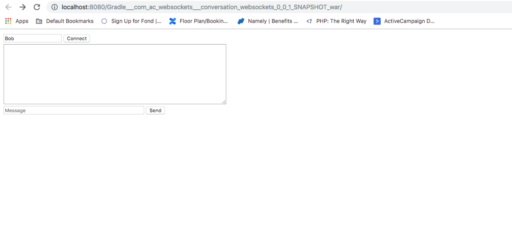

# Conversations Java Web Application Sockets

## Set-up

### Tomcat (version 9.0.14)

Please Follow this [link](https://www.mulesoft.com/tcat/tomcat-linux) to setup
your local tomcat server.

Current set-up uses Java 11.

### IntelliJ Ultimate

Go to Preferences -> Build, Execution, Deployment -> Application Servers
and click on `+` and add tomcat server.

Go to Run -> Edit Configuration... and click on `+` and click on Tomcat Server
-> Local to connect local tomcat server to the created war file

Run the tomcat server.

You should see: 

